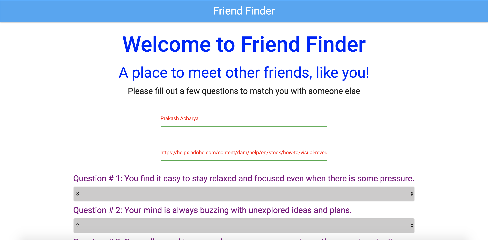
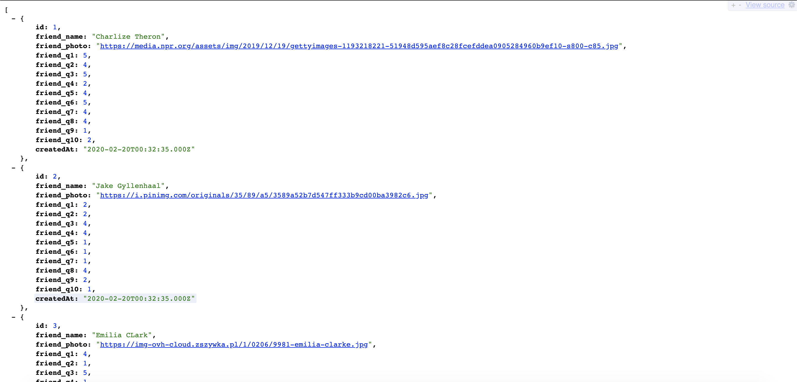

# friend-finder
<a href="https://friend-finder-app-01.herokuapp.com/">Checkout friendfinder app</a>

<h1>Overview</h1>

Friend finder is an app that matches new person with people from database. New user should answer 10 questions. The app with MySQL queries compare every answer of new user with every answer of every user in database and canculate best match.

<h2>Built with</h2>
<ul>
<li>HTML5 - Standardized system for tagging text files to achieve font, color, graphic, and hyperlink effects on World Wide Web pages.</li>
<li>CSS3 - Styling html webpages.</li>
<li>Bootstrap - Open source toolkit for developing with HTML, CSS, and JS.</li>
<li>Javascript - An object-oriented computer programming language.</li>
<li>jQuery - A javascript library to simplify programs.</li>
<li>MySQL - database</li>
<li>Node.js - An open source server environment.</li>
<li>NPM - express</li>
<li>NPM - body-parser </li>

</ul>

<h3>Instruction to Use:</h3>
<ol>
<li>Please ensure node.js is install, node.js is required to install packages from NPM. You can download the program at:</li>
https://nodejs.org/en/download/
<li>MySQL is required and should be active before running the "server.js" file.</li>
https://www.mysql.com/downloads/
<li>In your terminal navigate to your specified folder, type the following to install all required packages listed in package.json:</li>
<code> npm install</code>
<li>In your terminal navigate to db folder, type the following to run MySql</li>
<code> mysql - u root p(password)</code>
where password is the password of your MySql database

<li>Source database into your MySQL using terminal command</li>
<code> source schema.sql</code>
<li>Go to <code>connection.js</code> file and put the password on password field</li>
<code>node server.js</code>
<li>Start the server by writing in terminal:</li>
<code>node server.js</code>
</ol>

<h2>Screenshot</h2>

     

     

     

